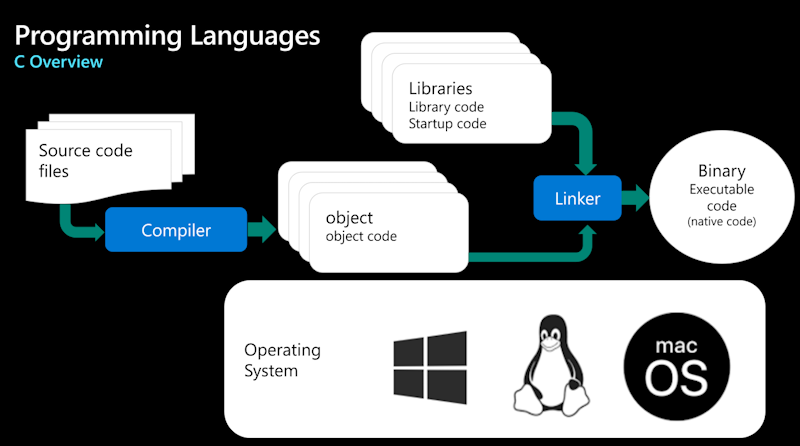
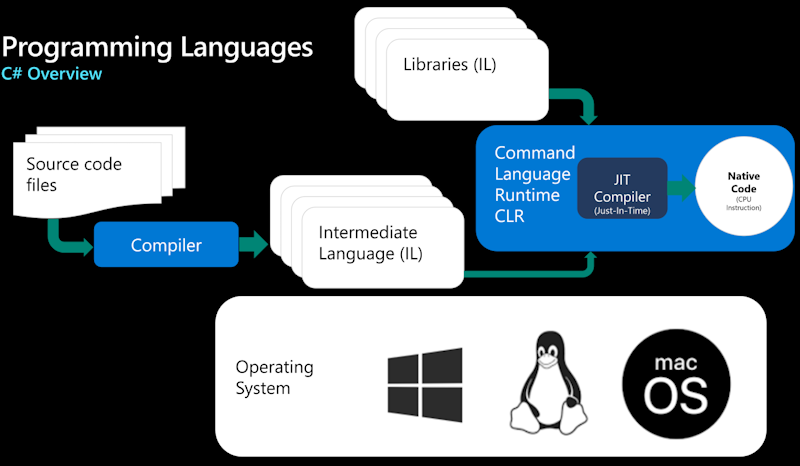
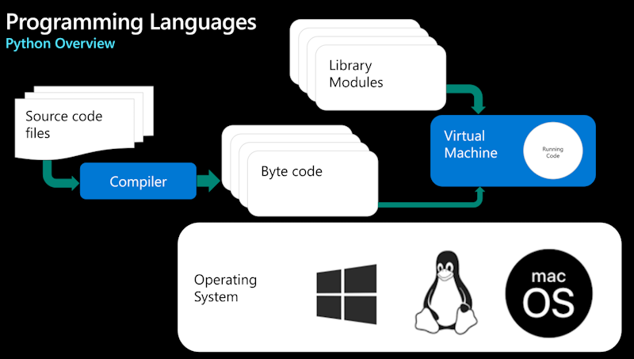

# Hello World Journey

Be part of the journey and get started exploring Programming languages, source code, tools, cloud,...

## Getting Started

In this repository, you'll find scripts, source code files to build Hello World applications in different Programming Languages.

Some Hello World applications will be deployed in the cloud.

This chapter describes how to :

1. Install the pre-requisites including Visual Studio Code, Dev Container
2. Install the tools associated with each Programming Language
3. Build and run the Hello World applications
  
This repository contains the following resources :

- A Dev container under '.devcontainer' folder
- The source code of the Hello World applications in different languages under 'src' folder

### Installing the pre-requisites

In order to test the solution, you need first an Azure Subscription, you can get further information about Azure Subscription [here](https://azure.microsoft.com/en-us/free).

You also need to install Git client and Visual Studio Code on your machine, below the links.

|[](https://git-scm.com/download/win) |[](https://git-scm.com/download/linux)|[](https://git-scm.com/download/mac)|
|:---|:---|:---|
| [Git Client for Windows](https://git-scm.com/download/win) | [Git client for Linux](https://git-scm.com/download/linux)| [Git Client for MacOs](https://git-scm.com/download/mac) |
[Visual Studio Code for Windows](https://code.visualstudio.com/Download)  | [Visual Studio Code for Linux](https://code.visualstudio.com/Download)  &nbsp;| [Visual Studio Code for MacOS](https://code.visualstudio.com/Download) &nbsp; &nbsp;|

Once the Git client is installed you can clone the repository on your machine running the following commands:

1. Create a Git directory on your machine

    ```bash
        c:\> mkdir git
        c:\> cd git
        c:\git>
    ```

2. Clone the repository.  
    For instance:

    ```bash
        c:\git> git clone  https://github.com/flecoqui/HelloWorld.git 
        c:\git> cd ./HelloWorld
        c:\git\HelloWorld> 
    ```

### Using Dev Container

#### Installing Dev Container pre-requisites

You need to install the following pre-requisite on your machine

1. Install and configure [Docker](https://www.docker.com/get-started) for your operating system.

   - Windows / macOS:

     1. Install [Docker Desktop](https://www.docker.com/products/docker-desktop) for Windows/Mac.

     2. Right-click on the Docker task bar item, select Settings / Preferences and update Resources > File Sharing with any locations your source code is kept. See [tips and tricks](https://code.visualstudio.com/docs/remote/troubleshooting#_container-tips) for troubleshooting.

     3. If you are using WSL 2 on Windows, to enable the [Windows WSL 2 back-end](https://docs.docker.com/docker-for-windows/wsl/): Right-click on the Docker taskbar item and select Settings. Check Use the WSL 2 based engine and verify your distribution is enabled under Resources > WSL Integration.

   - Linux:

     1. Follow the official install [instructions for Docker CE/EE for your distribution](https://docs.docker.com/get-docker/). If you are using Docker Compose, follow the [Docker Compose directions](https://docs.docker.com/compose/install/) as well.

     2. Add your user to the docker group by using a terminal to run: 'sudo usermod -aG docker $USER'

     3. Sign out and back in again so your changes take effect.

2. Ensure [Visual Studio Code](https://code.visualstudio.com/) is already installed.

3. Install the [Remote Development extension pack](https://marketplace.visualstudio.com/items?itemName=ms-vscode-remote.vscode-remote-extensionpack)

#### Using Visual Studio Code and Dev Container

1. Launch Visual Studio Code in the folder where you cloned the 'ps-data-foundation-imv' repository

    ```bash
        c:\git\HelloWorld> code .
    ```

2. Once Visual Studio Code is launched, you should see the following dialog box:

    

3. Click on the button 'Reopen in Container'
4. Visual Studio Code opens the Dev Container. If it's the first time you open the project in container mode, it first builds the container, it can take several minutes to build the new container.
5. Once the container is loaded, you can open a new terminal (Terminal -> New Terminal).
6. And from the terminal, you have access to the tools installed in the Dev Container like az client,....

    ```bash
        vscode ➜ /workspace/HelloWorld $ az login 
    ```

## Programming Languages Overview

The subsequent chapters describe how to write basic applications in different programming language.
For each language, a bash file (Linux) or a command file (Windows) is available to install the tools associated with the programming language on Linux or Windows.

- ./src/[Programming Language Name]/install.cmd: Installation script on Windows
- ./src/[Programming Language Name]/install.sh: Installation script on Linux

Moreover, for each language, a serie of samples is available and for each sample bash files called build.sh and run.sh are available to build and run the sample application.  

## C Programming Language



### Install C compilers and linkers

#### Install gcc on Windows

1. Information about the GCC compiler on Windows available here:
     https://www.mingw-w64.org/

2. Install MSYS2 on your machine
    Information: https://www.msys2.org/ 
    Binaries: https://github.com/msys2/msys2-installer/releases/download/2024-05-07/msys2-x86_64-20240507.exe 

3. Install GCC in MSYS2 shell terminal:

```bash
    pacman -S mingw-w64-ucrt-x86_64-gcc
```

4. Run GCC:

```bash
   gcc –version
   gcc.exe (Rev6, Built by MSYS2 project) 13.2.0
Copyright (C) 2023 Free Software Foundation, Inc.
This is free software; see the source for copying conditions.  There is NO
warranty; not even for MERCHANTABILITY or FITNESS FOR A PARTICULAR PURPOSE.
```

#### Install gcc on Linux

1. Update packages list, install build-essential and documentation:

```bash
    $ sudo apt update
    $ sudo apt install build-essential
    $ sudo apt-get install manpages-dev
    $ gcc --version
```

### Sample 1: Hello World

**Source code: [test.c](./src/c/test1/test.c)**

```c
    #include "stdio.h"
    int main()
    {
        printf("Hello World\n");
    }
```

**build command:**

```bash
    gcc test.c  -o test.exe 
```

**build command to optimize size:**

```bash
    gcc test.c  -o testsmall.exe  -O2 -s
```

**build command to generate assembly code:**

```bash
    gcc -o test.asm  -S  test.c
```

**assembly code with gcc running on Linux:**

```asm
        .file	"test.c"
        .text
        .section	.rodata
    .LC0:
        .string	"Hello World"
        .text
        .globl	main
        .type	main, @function
    main:
    .LFB0:
        .cfi_startproc
        endbr64
        pushq	%rbp
        .cfi_def_cfa_offset 16
        .cfi_offset 6, -16
        movq	%rsp, %rbp
        .cfi_def_cfa_register 6
        leaq	.LC0(%rip), %rax
        movq	%rax, %rdi
        call	puts@PLT
        movl	$0, %eax
        popq	%rbp
        .cfi_def_cfa 7, 8
        ret
        .cfi_endproc
    .LFE0:
        .size	main, .-main
        .ident	"GCC: (Ubuntu 11.4.0-1ubuntu1~22.04) 11.4.0"
        .section	.note.GNU-stack,"",@progbits
        .section	.note.gnu.property,"a"
        .align 8
        .long	1f - 0f
        .long	4f - 1f
        .long	5
    0:
        .string	"GNU"
    1:
        .align 8
        .long	0xc0000002
        .long	3f - 2f
    2:
        .long	0x3
    3:
        .align 8
    4:

```

**assembly code with gcc running on Windows:**

```asm
        .file	"test.c"
        .text
        .def	__main;	.scl	2;	.type	32;	.endef
        .section .rdata,"dr"
    .LC0:
        .ascii "Hello World\0"
        .text
        .globl	main
        .def	main;	.scl	2;	.type	32;	.endef
        .seh_proc	main
    main:
                                                                                        
        .seh_pushreg	%rbp
        movq	%rsp, %rbp
        .seh_setframe	%rbp, 0
        subq	$32, %rsp
        .seh_stackalloc	32
        .seh_endprologue
        call	__main
        leaq	.LC0(%rip), %rax
        movq	%rax, %rcx
        call	puts
        movl	$0, %eax
        addq	$32, %rsp
        popq	%rbp
        ret
        .seh_endproc
        .ident	"GCC: (Rev6, Built by MSYS2 project) 13.2.0"
        .def	puts;	.scl	2;	.type	32;	.endef

```

### Sample 2: Read input key

**Source code: [test.c](./src/c/test2/test.c)**

```c
    #include "stdio.h"
    int main()
    {
        char ch;
        printf("How is the World? M: Mad, B: Beautiful \n");
        ch=fgetc(stdin);
        if(ch=='M'){
            printf("Hello Mad World!\n");
        }
        else if(ch=='B'){
            printf("Hello Beautiful World!\n");
        }
        else{
            printf("Hello World!\n");
        }
    }
```

**build command:**

```bash
    gcc test.c  -o test.exe 
```

### Sample 3: Read input string (danger)

**Source code: [test.c](./src/c/test3/test.c)**

```c
    #include "stdio.h"

    int main()
    {
        char str[3];
            char const *sunny = "sunny";
        printf("How is the World?\n");
        gets(str);
        printf("Hello %s and %s World!\n",str,sunny);
    }
```

**build command:**

```bash
    gcc test.c  -o test.exe 
```

### Sample 4: Enter secure string

**Source code: [test.c](./src/c/test4/test.c)**

```c
	#include "stdio.h"
	#define MAX_LIMIT 3
	int main()
	{
		char str[MAX_LIMIT];
		char const *sunny = "sunny";
		printf("How is the World?\n");
		fgets(str, MAX_LIMIT, stdin);
		printf("Hello %s and %s World!\n",str,sunny);
	}
```

**build command:**

```bash
    gcc test.c  -o test.exe 
```

### Sample 5: Key Stroke Windows in while loop

**Source code: [test.c](./src/c/test5/test.c)**

```c
    #include <stdio.h>
    #include <conio.h>
    int main()
    {
        printf("The World is running, press escape to exit\n");
        while (1) {
            if ( kbhit() ) {
                int ch;
                ch = getch();
                if (ch == 0x1B){
                    printf("ESC key pressed, exit\n");
                    break;
                }
                else
                    printf("Key pressed = '%c'\n",ch);
            }
        }
        return 0;
    }
```

**build command:**

```bash
    gcc test.c  -o test.exe 
```


### Sample 6: Key Stroke Linux in while loop

**Source code: [test.c](./src/c/test6/test.c)**

```c
    #include <stdio.h>
    #include <stdlib.h>
    #include <string.h>
    #include <termios.h>
    #include <ctype.h>
    #include <sys/ioctl.h>
    #include <unistd.h>
    int kbhit()
    {
        int byteswaiting;
        ioctl(STDIN_FILENO, FIONREAD, &byteswaiting);
        return byteswaiting;
    }
    int getch(void)
    {
        int ch;
        ch = getchar();
        return ch;
    }
    void enable_raw_mode()
    {
        struct termios term;
        tcgetattr(STDIN_FILENO, &term);
        term.c_lflag &= ~(ICANON | ECHO); // Disable echo as well
        tcsetattr(STDIN_FILENO, TCSANOW, &term);
    }
    void disable_raw_mode()
    {
        struct termios term;
        tcgetattr(STDIN_FILENO, &term);
        term.c_lflag |= ICANON | ECHO;
        tcsetattr(STDIN_FILENO, TCSANOW, &term);
    }
    int main()
    {
        char ch;
        printf("The World is running, press escape to exit\n");
        enable_raw_mode();
        while (1) {
            if ( kbhit() ) {
            ch = getch();
                if (ch == 0x1B){
                    printf("ESC key pressed, exit\n");
                    break;
                }
                else
                    printf("Key pressed = '%c'\n",ch);
            }
        }
        disable_raw_mode();
        return 0;
    }
```

**build command:**

```bash
    gcc test.c  -o test.exe 
```

## Java Programming Language


### Install Java SDK

#### Install Java SDK on Windows

1. Download the JDK version 21 from there: https://www.oracle.com/java/technologies/downloads/#jdk21-windows
2. Follow the steps to install the JDK on your local machine  

#### Install Java SDK on Linux

1. Download the JDK version 21 running the following command in a terminal:

```bash
    sudo wget https://download.oracle.com/java/21/latest/jdk-21_linux-x64_bin.deb
```

2. Run the following command to install the JDK 21 on your machine running Linux  

```bash
    sudo dpkg -i jdk-21_linux-x64_bin.deb
```

### Sample 1: Hello World

**Source code: [test.java](./src/java/test1/test.java)**

```java
    class Program
    { 
        public static void main(String []args) 
        { 
            System.out.println("Hello world"); 
        } 
    } 
```

**build and run commands:**

```bash
    javac -d bin test.java
    java test.java
```

### Sample 2: Key String detection

**Source code: [test.java](./src/java/test2/test.java)**

```java
    import java.util.Scanner; 

    class Program
    { 
        public static void main(String []args) 
        { 
            System.out.println("How is the World? M: Mad, B: Beautiful ");
            Scanner scanner = new Scanner(System.in);
            char ch = scanner.next().charAt(0);
            if(ch=='M'){
                System.out.println("Hello Mad World!\n");
            }
            else if(ch=='B'){
                System.out.println("Hello Beautiful World!\n");
            }
            else{
                System.out.println("Hello World!\n");
            }
        } 
    }  
```

**build and run commands:**

```bash
    javac -d bin test.java
    java test.java
```


### Sample 3: Enter string

**Source code: [test.java](./src/java/test3/test.java)**

```java
    import java.util.Scanner; 
    class Program
    { 
        public static void main(String []args) 
        { 
            String sunny = "sunny";
            System.out.println("How is the World?");
            Scanner scanner = new Scanner(System.in);
            String str = scanner.next();
            if (str == null || str.isEmpty() || str.trim().isEmpty()) 
                System.out.printf("Hello %s World!\n",sunny);
            else
                System.out.printf("Hello %s and %s World!\n", str, sunny);        
        } 
    } 
```

**build and run commands:**

```bash
    javac -d bin test.java
    java test.java
```


### Sample 4: Key Stroke in while loop

**Source code: [test.java](./src/java/test4/test.java)**

```java
    import java.util.Scanner; 
    class Program {
        public static void main(String []args) 
        {  
            System.out.printf("The World is running, press escape to exit?");
            while(true)
            {
                Scanner scanner = new Scanner(System.in);
                char ch = scanner.next().charAt(0);

                if(ch==27){
                    System.out.printf("ESC key pressed, exit\n");
                    break;
                }
                else
                    System.out.printf("Key pressed = %c", ch);
            }
        } 
    }
```

**build and run commands:**

```bash
    javac -d bin test.java
    java test.java
```

## C# Programming Language



### Install DotNet SDK

#### Install DotNet SDK on Windows

1. Download dotnet v8 for Windows from https://dotnet.microsoft.com/en-us/download/dotnet/8.0 
2. Follow the steps to install DotNet SDK v8.0 on Windows

#### Install DotNet SDK on Linux

1. Run the following commands to install DotNet SDK v8.0 on Linux

```bash
    sudo apt-get update 
    sudo apt-get install -y apt-transport-https 
    sudo apt-get install -y dotnet-sdk-8.0
```

### Sample 1: Hello World

**Source code: [test.cs](./src/c#/test1/test.cs)**

```c#
    public class Program
    {
        public static void Main(string[] args)
        {
            System.Console.WriteLine("Hello World");
        }
    }
```

**build and run commands:**

```bash
    dotnet restore
    dotnet build
    dotnet run
```

### Sample 2: Self Contained Binary

**Source code: [test.cs](./src/c#/test2/test.cs)**

```c#
    public class Program
    {
        public static void Main(string[] args)
        {
            System.Console.WriteLine("Hello World");
        }
    }
```

**build and run commands on Linux:**

```bash
    dotnet restore
    dotnet build --self-contained -r   linux-x64
    ./bin/Debug/net8.0/linux-x64/test
```

**build and run commands on Windows:**

```bash
    dotnet restore
    dotnet build --self-contained -r   win-x64
    ./bin/Debug/net8.0/win-x64/test.exe    
```

### Sample 3: Key Stroke detection

**Source code: [test.cs](./src/c#/test3/test.cs)**

```c#
    public class Program
    {
        public static void Main(string[] args)
        {
            System.Console.WriteLine("How is the World? M: Mad, B: Beautiful ");
            while(!Console.KeyAvailable);
            System.ConsoleKey ch = Console.ReadKey(true).Key;
            if(ch==System.ConsoleKey.M){
                System.Console.WriteLine("Hello Mad World!\n");
            }
            else if(ch==System.ConsoleKey.B){
                System.Console.WriteLine("Hello Beautiful World!\n");
            }
            else{
                System.Console.WriteLine("Hello World!\n");
            }
        }
    }
```

**build and run commands:**

```bash
    dotnet restore
    dotnet build
    dotnet run
```

### Sample 4: Enter string

**Source code: [test.cs](./src/c#/test4/test.cs)**

```c#
    public class Program
    {
        public static void Main(string[] args)
        {
            string sunny = "sunny";
            System.Console.WriteLine("How is the World?");
            string? str = Console.ReadLine();
            if(string.IsNullOrEmpty(str))
                System.Console.WriteLine($"Hello {sunny} World!");
            else
                System.Console.WriteLine($"Hello {str} and {sunny} World!");
        }
    }
```

**build and run commands:**

```bash
    dotnet restore
    dotnet build
    dotnet run
```

### Sample 5: Key Stroke in while loop

**Source code: [test.cs](./src/c#/test5/test.cs)**

```c#
    public class Program
    {
        public static void Main(string[] args)
        {
            System.ConsoleKey ch; 
            System.Console.WriteLine("The World is running, press escape to exit?");
            while(true)
            {
                if(Console.KeyAvailable){
                    ch = Console.ReadKey(true).Key;
                    if(ch==System.ConsoleKey.Escape){
                        System.Console.WriteLine("ESC key pressed, exit");
                        break;
                    }
                    else
                        System.Console.WriteLine($"Key pressed = {ch} , exit");
                }
            }
        }
    }
```

**build and run commands:**

```bash
    dotnet restore
    dotnet build
    dotnet run
```

## Python Programming Language



### Install Python SDK 3.10

1. Download Python SDK 3.10 for Windows from https://www.python.org/downloads/windows/
2. Follow the steps to install Python SDK 3.10 on Windows

### Install Python SDK 3.10 on Linux

1. Run the following commands to install Python SDK v3.10 on Linux

```bash
    sudo apt update
    sudo apt install software-properties-common -y
    sudo add-apt-repository ppa:deadsnakes/ppa
    sudo apt update
    sudo apt install python3.10 python3.10-venv python3.10-dev
    python3 --version
    ls -la /usr/bin/python3
    sudo rm /usr/bin/python3
    sudo ln -s python3.10 /usr/bin/python3
    python3 --version
    curl -sS https://bootstrap.pypa.io/get-pip.py | python3.10
    python3 -m pip --version
    python3.10 -m pip install ipython
    python3.10 -m venv venv
    pip install ipython
```

### Sample 1: Hello World

**Source code: [test.py](./src/python/test1/test.py)**

```python
    print("Hello World")
```

**Run command:**

```bash
    python ./test.py
```

### Sample 2: Key Stroke detection

**Source code: [test.py](./src/python/test2/test.py)**

```python
    from getkey import getkey

    print("How is the World? M: Mad, B: Beautiful")
    key = getkey()
    if key == "M":
        print("Hello Mad World!")
    else:
        if key == "B":
            print("Hello Beautiful World!")
        else:
            print("Hello World!")
```

**Run command:**

```bash
    python ./test.py
```

### Sample 3: Enter string

**Source code: [test.py](./src/python/test3/test.py)**

```python
    sunny = "sunny"
    str = input("How is the World?\n")
    if not str.split(): 
        print(f"Hello {sunny} World!")
    else:
        print(f"Hello {str} and {sunny} World!")    
```

**Run command:**

```bash
    python ./test.py
```

### Sample 4: Key Stroke in while loop

**Source code: [test.py](./src/python/test4/test.py)**

```python
    from getkey import getkey

    print("The World is running, press escape to exit?")
    while True:
        key = getkey()
        if ord(key) == 27:
            print("ESC key pressed, exit!")
            break
        else:
            print(f"Key pressed = {key} ")
```

**Build and Run command:**

```bash
    pip install getkey
    python ./test.py
```

## HTML/Javascript Programming Language


### Install Node.js

Node.js is used to run locally an http server which will serve the HTML and Javascript files.

### Install Node.js on Windows

1. Download Node.js for Windows from https://nodejs.org/en/download/package-manager 
2. Follow the steps to install Node.js on Windows

### Install Node.js on Linux

1. Run the following commands to install Node.js on Linux

```bash
    curl -fsSL https://deb.nodesource.com/setup_lts.x | sudo -E bash - 
    sudo apt-get install -y nodejs \
    sudo  npm install -g npm@latest 
    sudo npm install http-server -g
```

### Sample 1: Hello World

**Source code: [index.html](./src/html/test1/index.html)**

```html
    <!doctype html>
    <html lang="en">
    <body>
        <h1>Hello World</h1>
    </body>
    </html>
```

**Run command:**

```bash
    http-server .  -c-1
```

### Sample 2: Key Stroke detection

**Source code: [index.html](./src/html/test2/index.html) and [index.js](./src/html/test2/index.js)**

```html
    <!doctype html>
    <html lang="en">
    <body>
        <h1>How is the World (M: Mad, B: Beautiful)?</h1>
        <script src="index.js"></script>
    </body>
    </html>
```

```javascript
    document.addEventListener("keypress", function(event) {
        if (event.key === "M") {
        alert('Hello Mad World!');
        }
        else if (event.key === "B") {
        alert('Hello Beautiful World!');
        }
        else{
            alert('Hello World!');
        }
    });
```

**Run command:**

```bash
    http-server .  -c-1
```

### Sample 3: Enter string

**Source code: [index.html](./src/html/test3/index.html) and [index.js](./src/html/test3/index.js)**

```html
    <!doctype html>
    <html lang="en">
    <body>
        <h1>How is the World (enter the adjective below)?</h1>
        <input name="status" type="text" maxlength="48" id="statusId" />
        <button id="statusButton">Ok</button>
        <script src="index.js"></script>
    </body>
    </html>
```

```javascript
    button=document.getElementById("statusButton")

    button.addEventListener("click", function(event) {
        var status = document.getElementById("statusId").value;
        if (status && status.length > 0) {
        alert(`Hello ${status} World!`);
        }
        else {
        alert('Hello  World!');
        }
    });
```

**Run command:**

```bash
    http-server .  -c-1
```

### Sample 4: Key Stroke in while loop

**Source code: [index.html](./src/html/test4/index.html) and [index.js](./src/html/test4/index.js)**

```html
    <!doctype html>
    <html lang="en">
    <body>
        <h1>The World is running, press escape to exit</h1>
        <div>
            <div>
            <label name="status" type="text" maxlength="48" id="statusId" width="400px"></label>
            </div>
            <div>
            <label name="logs" type="text" maxlength="48" id="logId" width="400px"></label>
            </div>  
        </div>
        <script src="index.js"></script>
    </body>
    </html>
```

```javascript
    document.addEventListener("DOMContentLoaded", function(e) {
    var statusCtl = document.getElementById("statusId")
    if (statusCtl){
        statusCtl.innerHTML = "Running"
    }
    });

    document.addEventListener("keydown", function(event) {
    if (event.key === "Escape") {
        var statusCtl = document.getElementById("statusId")
        if (statusCtl){
            statusCtl.innerHTML = "Not running"
        };
    }
    var logCtl = document.getElementById("logId");
    if (logCtl){
        logCtl.innerHTML = `Key ${event.key} pressed!`
    };
    });
```

**Run command:**

```bash
    http-server .  -c-1
```
